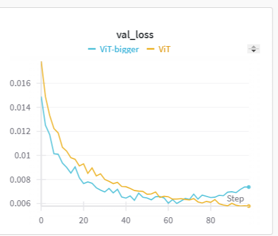
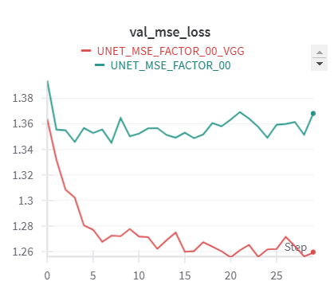

# processing_and_generating_images_course

## Запольский Максим Михайлович

## Info

- Точка входа `main.py`
- Графики по экспериментам хранятся в папках `~/experiment_name`
- [логи wandb](https://wandb.ai/revelia/HW2-img-processing-course)


## Предобработка данных

Заранее вычислим mean и std на нашем датасете:

```python
MEAN = [0.42343804240226746, 0.5342181324958801, 0.4620889723300934]
STD = [0.04519784078001976, 0.05054565891623497, 0.046623989939689636]
```

При обучении будем использовать следующие трансформации:
```python
    transform = transforms.Compose([
        transforms.Resize(image_size),
        transforms.RandomHorizontalFlip(p=0.5),
        transforms.RandomVerticalFlip(p=0.5),
        transforms.ToTensor(),
        transforms.Normalize(mean, std)
    ])
```

Отражения для аугментации, Resize для приведения картинок к одному размеру (они имеют слегка разное разрешение в датасете)

Другие аргументации, кажется, смысла не имеют

## Архитектура

Будем использовать U-net




## Обучение

### Loss
В качестве loss функции будем среднее

$$loss = \lambda \cdot loss_{MSE} + (1 - \lambda )\cdot loss_{perceptual} $$

Где $loss_{perceptual}$ вычисляется как 

$$loss_{perceptual} = MSE[AlexNet(original), AlexNet(reconstruction)]$$

### Данные

В самом начале поделим train на train/val датасеты с соотношением 0.9/0.1.

### Пайплайн

Будем делать следующее:

1. Учимся на train, следя за метриками на валидации, чтобы не допустить переобучения
2. По val/proliv подбираем пороговое значение на основе: f1, tpr=0.95, tnr=0.95
3. Для полученных пороговых значений вычисляем метрики на тесте.

## Эксперименты

### MSE_FACTOR

Проведем серию экспериментов, варьируя MSE_FACTOR:

```python
        {"experiment_name": "UNET_MSE_FACTOR_00", "mse_factor": 0.0},
        {"experiment_name": "UNET_MSE_FACTOR_03", "mse_factor": 0.3},
        {"experiment_name": "UNET_MSE_FACTOR_06", "mse_factor": 0.6},
        {"experiment_name": "UNET_MSE_FACTOR_08", "mse_factor": 0.8},
        {"experiment_name": "UNET_MSE_FACTOR_10", "mse_factor": 0.10},
```

Графики экспериментов и пример реконструкции будут лежать в соответствующих папках, логи обучения в wandb. Приведем тут только краткие результаты:


| Эксперимент             | Выбор порога | Порог      | TP  | FP  | TN   | FN  | TPR    | TNR    |
|-------------------------|--------------|------------|-----|-----|------|-----|--------|--------|
| **UNET_MSE_FACTOR_00**  | Best F1      | 1.3541     | 126 | 618 | 3047 | 3   | 0.9767 | 0.8314 |
|                         | TPR 95       | 1.5132     | 124 | 554 | 3111 | 5   | 0.9612 | 0.8488 |
|                         | TNR 95       | 0.7251     | 129 | 1653| 2012 | 0   | 1.0000 | 0.5490 |
|                         | TNR TPR AVG  | 1.1191     | 129 | 837 | 2828 | 0   | 1.0000 | 0.7716 |
| **UNET_MSE_FACTOR_03**  | Best F1      | 1.5502     | 128 | 647 | 3018 | 1   | 0.9922 | 0.8235 |
|                         | TPR 95       | 1.6062     | 128 | 615 | 3050 | 1   | 0.9922 | 0.8322 |
|                         | TNR 95       | 1.0891     | 129 | 1257| 2408 | 0   | 1.0000 | 0.6570 |
|                         | TNR TPR AVG  | 1.3476     | 129 | 812 | 2853 | 0   | 1.0000 | 0.7784 |
| **UNET_MSE_FACTOR_06**  | Best F1      | 1.7432     | 128 | 647 | 3018 | 1   | 0.9922 | 0.8235 |
|                         | TPR 95       | 1.8962     | 122 | 594 | 3071 | 7   | 0.9457 | 0.8379 |
|                         | TNR 95       | 1.3671     | 129 | 1025| 2640 | 0   | 1.0000 | 0.7203 |
|                         | TNR TPR AVG  | 1.6317     | 129 | 700 | 2965 | 0   | 1.0000 | 0.8090 |
| **UNET_MSE_FACTOR_08**  | Best F1      | 1.6372     | 126 | 729 | 2936 | 3   | 0.9767 | 0.8011 |
|                         | TPR 95       | 1.7282     | 121 | 674 | 2991 | 8   | 0.9380 | 0.8161 |
|                         | TNR 95       | 1.4851     | 129 | 942 | 2723 | 0   | 1.0000 | 0.7430 |
|                         | TNR TPR AVG  | 1.6067     | 126 | 750 | 2915 | 3   | 0.9767 | 0.7954 |
| **UNET_MSE_FACTOR_010** | Best F1      | 1.5012     | 129 | 630 | 3035 | 0   | 1.0000 | 0.8281 |
|                         | TPR 95       | 1.7832     | 122 | 503 | 3162 | 7   | 0.9457 | 0.8628 |
|                         | TNR 95       | 0.8841     | 129 | 1510| 2155 | 0   | 1.0000 | 0.5880 |
|                         | TNR TPR AVG  | 1.3336     | 129 | 762 | 2903 | 0   | 1.0000 | 0.7921 |

Видно, что фичи AlexNet улучшают метрики

### VGG16 вместо AlexNet
Попробуем вместо AlexNet использовать VGG16:

Результат эксперимента следующий:


| Эксперимент               | Выбор порога      | Порог      | TP  | FP   | TN   | FN  | TPR    | TNR    |
|---------------------------|--------------|------------|-----|------|------|-----|--------|--------|
| **UNET_MSE_FACTOR_00_VGG** | Best F1      | 0.3280     | 127 | 812  | 2853 | 2   | 0.9845 | 0.7784 |
|                           | TPR 95       | 0.3330     | 126 | 788  | 2877 | 3   | 0.9767 | 0.7850 |
|                           | TNR 95       | 0.2360     | 129 | 1381 | 2284 | 0   | 1.0000 | 0.6232 |
|                           | TNR TPR AVG  | 0.2845     | 129 | 1023 | 2642 | 0   | 1.0000 | 0.7209 |
| **UNET_MSE_FACTOR_03_VGG** | Best F1      | 0.7401     | 128 | 623  | 3042 | 1   | 0.9922 | 0.8300 |
|                           | TPR 95       | 0.7771     | 124 | 602  | 3063 | 5   | 0.9612 | 0.8357 |
|                           | TNR 95       | 0.6391     | 129 | 794  | 2871 | 0   | 1.0000 | 0.7834 |
|                           | TNR TPR AVG  | 0.7081     | 128 | 668  | 2997 | 1   | 0.9922 | 0.8177 |
| **UNET_MSE_FACTOR_06_VGG** | Best F1      | 1.0701     | 127 | 641  | 3024 | 2   | 0.9845 | 0.8251 |
|                           | TPR 95       | 1.0951     | 123 | 629  | 3036 | 6   | 0.9535 | 0.8284 |
|                           | TNR 95       | 0.9951     | 129 | 727  | 2938 | 0   | 1.0000 | 0.8016 |
|                           | TNR TPR AVG  | 1.0451     | 127 | 665  | 3000 | 2   | 0.9845 | 0.8186 |


Как будто особой разницы нет.


Из забавного, наглядно видно, что фичи vgg более согласованы с минимизацией MSE, чем фичи AlexNet (что ожидаемо)



Как следствие, вес 0.3 у MSE с фичами VGG позволяет сойтись примерно к тому же, к чему вес 0.8 с фичами AlexNet


### Зашумление во время обучения

Попробуем во время обучения зашумлять изображение белыми кругами, имитируя артефакты, которые возникают в датасете proliv, и заставляя модель учиться такие артефакты исправлять.

Будем зашумлять 1/3 батча

| Метрика      | Выбор порога      | TP  | FP  | TN   | FN  | TPR    | TNR    |
|--------------|------------|-----|-----|------|-----|--------|--------|
| Best F1      | 0.9151     | 119 | 545 | 3120 | 10  | 0.9225 | 0.8513 |
| TPR 95       | 0.8631     | 121 | 561 | 3104 | 8   | 0.9380 | 0.8469 |
| TNR 95       | 0.6411     | 129 | 769 | 2896 | 0   | 1.0000 | 0.7902 |
| TNR TPR AVG  | 0.7521     | 127 | 617 | 3048 | 2   | 0.9845 | 0.8317 |


Кажется, что тоже значимых улучшений нет


Попробуем зашумлять весь батч


## Итог

В целом, результаты не очень. Такое ощущение, что распределение "проливов" в тестовых данных какое-то другое, потому что для тех, которые на валидации, вроде как метрики получается получить очень высокие, следовательно, по каким то причинам валидация некорректная.


